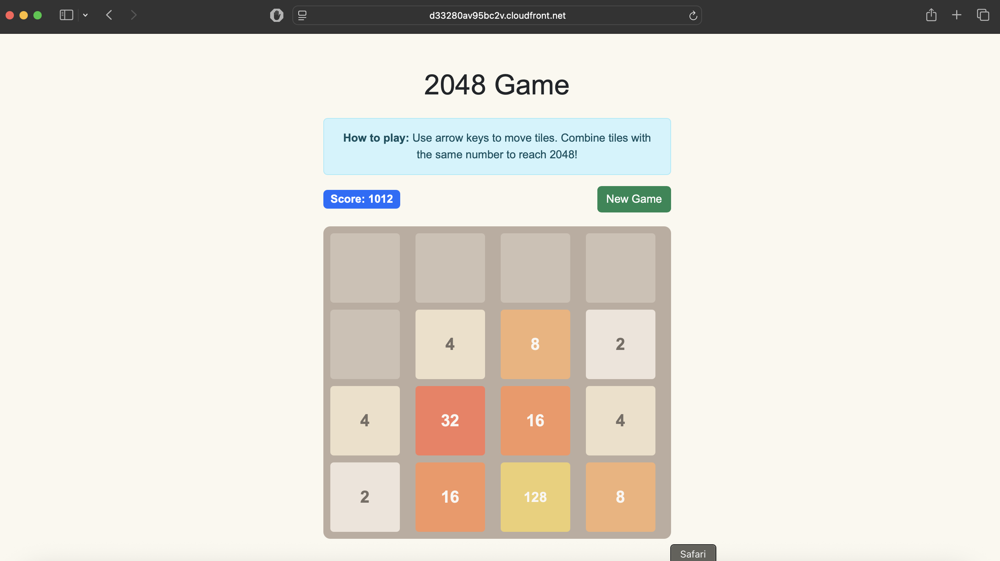

# Host a Static Website on S3, Deploying a 2048 Game

> **Complete AWS S3 + CloudFront tutorial - Learn cloud hosting by building and deploying a fun 2048 game!**



**🎮 This is my score - what's yours? Let's deploy, learn and play while you build a static website on AWS!**

## 🚀 Quick Deploy

```bash
# Clone and deploy
git clone https://github.com/schinchli/aws-s3-2048-game.git
cd aws-s3-2048-game
./deploy.sh
```

## 🎯 What You'll Learn

- **S3 Static Website Hosting** - Bucket configuration and public access
- **CloudFront CDN** - Global content delivery with HTTPS
- **Bootstrap Framework** - Responsive web design
- **AWS CLI Automation** - Infrastructure as code

## 🎮 Game Features

- **2048 Game Logic** - Complete JavaScript implementation
- **Responsive Design** - Works on all devices
- **Bootstrap Styling** - Professional UI components
- **Custom 404 Page** - Error handling

## 📋 What the Script Does

1. ✅ Creates unique S3 bucket
2. ✅ Enables static website hosting
3. ✅ Configures public read access
4. ✅ Uploads game files
5. ✅ Creates CloudFront distribution
6. ✅ Provides live URLs

## 🔧 Prerequisites

- AWS CLI configured with appropriate permissions
- `jq` for JSON processing

## 💰 Cost

- **~$0.03/month** for small websites
- **Free tier eligible** for CloudFront and S3

## 🎓 Learning Path

1. **Deploy** - Run the script and see it work
2. **Play** - Enjoy the 2048 game on AWS
3. **Learn** - Read the comprehensive learning guide
4. **Customize** - Modify and redeploy

## 📚 Additional Resources

- [AWS S3 Static Website Hosting Guide](https://docs.aws.amazon.com/AmazonS3/latest/userguide/WebsiteHosting.html)
- [CloudFront Developer Guide](https://docs.aws.amazon.com/cloudfront/latest/DeveloperGuide/)
- [Bootstrap 5 Documentation](https://getbootstrap.com/docs/5.3/)

---

**🎉 Ready to deploy your first AWS static website? Run `./deploy.sh` and start playing!**
