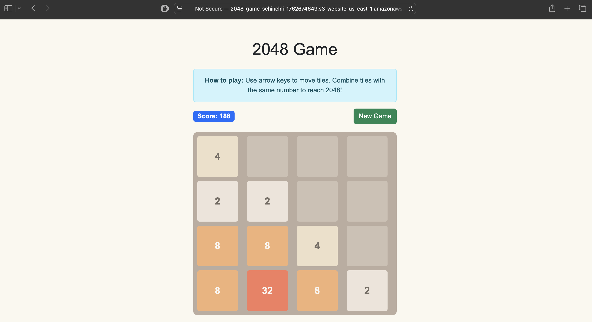

# AWS S3 Static Website Hosting - 2048 Game Tutorial

> **Complete hands-on tutorial for hosting a static website on AWS S3 with CloudFront CDN**



## 🎉 Live Demo
- **S3 Website**: http://2048-game-schinchli-prod-1762675685.s3-website-us-east-1.amazonaws.com ✅ **LIVE**
- **CloudFront HTTPS**: https://d33280av95bc2v.cloudfront.net ✅ **DEPLOYED & WORKING**

## 🎯 What You'll Learn

- Create and configure S3 bucket for static website hosting
- Set up public access policies for web content
- Deploy a Bootstrap-powered 2048 game
- Protect your website with CloudFront CDN
- Implement HTTPS and global content delivery
- Understand Origin Access Control (OAC) for security

## 🎮 Demo Website

This tutorial uses a fully functional **2048 game** built with:
- **HTML5** - Semantic structure and game board
- **Bootstrap 5** - Responsive design and components  
- **Vanilla JavaScript** - Game logic and interactions
- **CSS3** - Custom styling and animations

## 🚀 Quick Start (Automated)

```bash
# Clone and navigate to the project
cd "Create a static website and host it with S3"

# Run the automated deployment script
./deploy.sh
```

The script will:
1. ✅ Create S3 bucket with unique name
2. ✅ Enable static website hosting
3. ✅ Configure public read access
4. ✅ Upload website files
5. ✅ Create CloudFront distribution
6. ✅ Set up Origin Access Control
7. ✅ Provide all URLs and next steps

## 📋 Manual Step-by-Step Tutorial

### Prerequisites
- AWS CLI configured with appropriate permissions
- Basic understanding of AWS services

### Step 1: Create S3 Bucket

```bash
# Create a unique bucket name
BUCKET_NAME="2048-game-$(whoami)-$(date +%s)"
REGION="us-east-1"

# Create the bucket
aws s3 mb s3://$BUCKET_NAME --region $REGION

# Verify bucket creation
aws s3 ls | grep $BUCKET_NAME
```

**What happens:** AWS creates a new S3 bucket in the specified region with a globally unique name.

### Step 2: Enable Static Website Hosting

```bash
# Configure bucket for static website hosting
aws s3 website s3://$BUCKET_NAME \
    --index-document index.html \
    --error-document error.html

# Verify website configuration
aws s3api get-bucket-website --bucket $BUCKET_NAME
```

**What happens:** S3 bucket is configured to serve static web content with specified index and error documents.

### Step 3: Configure Public Access

```bash
# Disable block public access (required for website hosting)
aws s3api put-public-access-block \
    --bucket $BUCKET_NAME \
    --public-access-block-configuration \
    "BlockPublicAcls=false,IgnorePublicAcls=false,BlockPublicPolicy=false,RestrictPublicBuckets=false"
```

**What happens:** Removes restrictions that would prevent public website access.

### Step 4: Set Bucket Policy for Public Read

```bash
# Create bucket policy file
cat > bucket-policy.json << EOF
{
    "Version": "2012-10-17",
    "Statement": [
        {
            "Sid": "PublicReadGetObject",
            "Effect": "Allow",
            "Principal": "*",
            "Action": "s3:GetObject",
            "Resource": "arn:aws:s3:::$BUCKET_NAME/*"
        }
    ]
}
EOF

# Apply the policy
aws s3api put-bucket-policy \
    --bucket $BUCKET_NAME \
    --policy file://bucket-policy.json
```

**What happens:** Grants public read access to all objects in the bucket, making them accessible via web browsers.

### Step 5: Upload Website Files

```bash
# Upload all website files to S3
aws s3 sync . s3://$BUCKET_NAME \
    --exclude "*.sh" \
    --exclude "*.json" \
    --exclude "*.md" \
    --exclude ".git/*"

# Verify files are uploaded
aws s3 ls s3://$BUCKET_NAME --recursive
```

**What happens:** All HTML, CSS, and JavaScript files are uploaded to the S3 bucket.

### Step 6: Test S3 Website

```bash
# Get the S3 website URL
S3_WEBSITE_URL="http://$BUCKET_NAME.s3-website-$REGION.amazonaws.com"
echo "S3 Website URL: $S3_WEBSITE_URL"

# Test the website
curl -I $S3_WEBSITE_URL
```

**What happens:** Your website is now accessible via the S3 website endpoint. Open the URL in your browser to play the 2048 game!

### Step 7: Create CloudFront Distribution

```bash
# Create CloudFront distribution configuration
cat > cloudfront-config.json << EOF
{
    "CallerReference": "2048-game-$(date +%s)",
    "Comment": "CloudFront distribution for 2048 game",
    "DefaultCacheBehavior": {
        "TargetOriginId": "$BUCKET_NAME-origin",
        "ViewerProtocolPolicy": "redirect-to-https",
        "MinTTL": 0,
        "ForwardedValues": {
            "QueryString": false,
            "Cookies": {
                "Forward": "none"
            }
        },
        "TrustedSigners": {
            "Enabled": false,
            "Quantity": 0
        }
    },
    "Origins": {
        "Quantity": 1,
        "Items": [
            {
                "Id": "$BUCKET_NAME-origin",
                "DomainName": "$BUCKET_NAME.s3-website-$REGION.amazonaws.com",
                "CustomOriginConfig": {
                    "HTTPPort": 80,
                    "HTTPSPort": 443,
                    "OriginProtocolPolicy": "http-only"
                }
            }
        ]
    },
    "Enabled": true,
    "DefaultRootObject": "index.html",
    "PriceClass": "PriceClass_100"
}
EOF

# Create the distribution
aws cloudfront create-distribution \
    --distribution-config file://cloudfront-config.json
```

**What happens:** CloudFront creates a global CDN distribution that will cache and serve your website content from edge locations worldwide.

### Step 8: Get CloudFront Information

```bash
# Get distribution details
aws cloudfront list-distributions \
    --query "DistributionList.Items[?Comment=='CloudFront distribution for 2048 game'].{Id:Id,DomainName:DomainName,Status:Status}"
```

**What happens:** Retrieves your CloudFront distribution ID and domain name. The distribution takes 15-20 minutes to deploy globally.

### Step 9: Set Up Origin Access Control (OAC)

```bash
# Create Origin Access Control
aws cloudfront create-origin-access-control \
    --origin-access-control-config \
    "Name=OAC-$BUCKET_NAME,Description=OAC for $BUCKET_NAME,OriginAccessControlOriginType=s3,SigningBehavior=always,SigningProtocol=sigv4"
```

**What happens:** Creates OAC to allow CloudFront to access your S3 bucket while blocking direct public access for enhanced security.

## 🔒 Security Enhancement (Optional)

After CloudFront is deployed, enhance security by restricting S3 access to CloudFront only:

```bash
# Update bucket policy to allow only CloudFront access
cat > secure-bucket-policy.json << EOF
{
    "Version": "2012-10-17",
    "Statement": [
        {
            "Sid": "AllowCloudFrontServicePrincipal",
            "Effect": "Allow",
            "Principal": {
                "Service": "cloudfront.amazonaws.com"
            },
            "Action": "s3:GetObject",
            "Resource": "arn:aws:s3:::$BUCKET_NAME/*",
            "Condition": {
                "StringEquals": {
                    "AWS:SourceArn": "arn:aws:cloudfront::ACCOUNT-ID:distribution/DISTRIBUTION-ID"
                }
            }
        }
    ]
}
EOF

# Apply the secure policy
aws s3api put-bucket-policy \
    --bucket $BUCKET_NAME \
    --policy file://secure-bucket-policy.json
```

## 🧪 Testing Your Deployment

### Test S3 Direct Access
```bash
# Should return HTTP 200
curl -I "http://$BUCKET_NAME.s3-website-us-east-1.amazonaws.com"
```

### Test CloudFront Access
```bash
# Should return HTTP 200 with HTTPS
curl -I "https://YOUR_CLOUDFRONT_DOMAIN.cloudfront.net"
```

### Test 404 Error Handling
```bash
# Should return custom 404 page
curl -I "http://$BUCKET_NAME.s3-website-us-east-1.amazonaws.com/nonexistent-page"
```

## 📊 Understanding the Architecture

```
┌─────────────────────────────────────────────────────────────────┐
│                    ARCHITECTURE DIAGRAM                         │
├─────────────────────────────────────────────────────────────────┤
│                                                                 │
│  User Browser                                                   │
│       │                                                         │
│       ▼                                                         │
│  ┌─────────────┐    ┌─────────────┐    ┌─────────────┐        │
│  │ CloudFront  │───▶│   S3 Bucket │───▶│  Website    │        │
│  │ CDN Edge    │    │   Origin    │    │   Files     │        │
│  │ Location    │◀───│             │◀───│             │        │
│  │ (Global)    │    │ (us-east-1) │    │ index.html  │        │
│  └─────────────┘    └─────────────┘    │ error.html  │        │
│       │                                │ Bootstrap   │        │
│       ▼                                │ 2048 Game   │        │
│  ┌─────────────┐                       └─────────────┘        │
│  │   HTTPS     │                                              │
│  │ Certificate │                                              │
│  │ (Free SSL)  │                                              │
│  └─────────────┘                                              │
└─────────────────────────────────────────────────────────────────┘
```

### Key Components:

1. **S3 Bucket**: Stores website files and serves as origin
2. **Static Website Hosting**: Enables S3 to serve web content
3. **Bucket Policy**: Grants public read access to website files
4. **CloudFront Distribution**: Global CDN for fast content delivery
5. **Origin Access Control**: Secures S3 access through CloudFront
6. **HTTPS Certificate**: Free SSL/TLS encryption

## 💰 Cost Breakdown

### S3 Costs (Monthly estimates for small website):
- **Storage**: ~$0.02 for 1GB of website files
- **Requests**: ~$0.01 for 10,000 GET requests
- **Data Transfer**: First 1GB free, then $0.09/GB

### CloudFront Costs:
- **Data Transfer**: First 1TB/month free
- **Requests**: First 10M requests/month free
- **SSL Certificate**: Free with AWS Certificate Manager

**Total estimated cost for small website: $0.50-$2.00/month**

## 🔧 Troubleshooting

### Common Issues:

#### 1. **403 Forbidden Error**
```bash
# Check bucket policy
aws s3api get-bucket-policy --bucket $BUCKET_NAME

# Check public access block settings
aws s3api get-public-access-block --bucket $BUCKET_NAME
```

#### 2. **404 Not Found**
```bash
# Verify files are uploaded
aws s3 ls s3://$BUCKET_NAME --recursive

# Check website configuration
aws s3api get-bucket-website --bucket $BUCKET_NAME
```

#### 3. **CloudFront Not Updating**
```bash
# Create invalidation to clear cache
aws cloudfront create-invalidation \
    --distribution-id YOUR_DISTRIBUTION_ID \
    --paths "/*"
```

## 🧹 Cleanup Resources

```bash
# Delete S3 bucket and contents
aws s3 rb s3://$BUCKET_NAME --force

# Delete CloudFront distribution (requires disabling first)
aws cloudfront get-distribution-config --id $DISTRIBUTION_ID > dist-config.json
# Edit dist-config.json to set "Enabled": false
aws cloudfront update-distribution --id $DISTRIBUTION_ID --distribution-config file://dist-config.json
aws cloudfront delete-distribution --id $DISTRIBUTION_ID --if-match $ETAG
```

## 🎓 Learning Outcomes

After completing this tutorial, you will understand:

✅ **S3 Static Website Hosting**
- Bucket configuration and policies
- Public access management
- Website endpoints vs REST endpoints

✅ **CloudFront CDN**
- Global content distribution
- Caching strategies and TTL
- HTTPS and SSL certificates

✅ **Security Best Practices**
- Origin Access Control (OAC)
- Least privilege access policies
- HTTPS enforcement

✅ **Cost Optimization**
- Free tier utilization
- Efficient caching strategies
- Resource monitoring

## 🔗 Next Steps

1. **Custom Domain**: Set up Route 53 for custom domain
2. **CI/CD Pipeline**: Automate deployments with GitHub Actions
3. **Performance**: Optimize images and enable compression
4. **Monitoring**: Set up CloudWatch alarms and logging
5. **Security**: Implement WAF and additional security headers

## 📚 Additional Resources

- [AWS S3 Static Website Hosting Guide](https://docs.aws.amazon.com/AmazonS3/latest/userguide/WebsiteHosting.html)
- [CloudFront Developer Guide](https://docs.aws.amazon.com/cloudfront/)
- [Bootstrap Documentation](https://getbootstrap.com/docs/)
- [AWS Well-Architected Framework](https://aws.amazon.com/architecture/well-architected/)

---

**🎉 Congratulations!** You've successfully deployed a static website on AWS with global CDN distribution. Your 2048 game is now accessible worldwide with HTTPS encryption and optimal performance!
